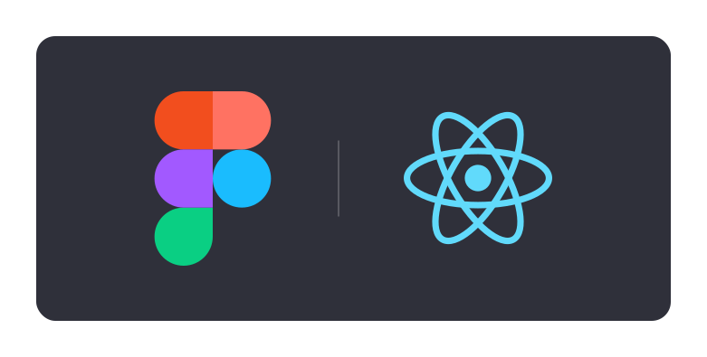

# Create React Figma Plugin



A tool to get you started making Figma plugins with a React UI <sup>1</sup>.

_This tool is in currently in beta so please report any bugs or issues_ 🙏

## Get started

You'll need to setup both your development environment and add the plugin to Figma in order to get developing your plugin.

### Dev enironment

To create the project template, run the following command. It will create a new folder in the directory you're running the command from with the project template.

```sh
npx @mtmeyer/create-react-figma-plugin
```

or for Typescript run the following command:

```sh
npx @mtmeyer/create-react-figma-plugin --typescript
```

Follow the prompts in the CLI to generate the project. Then get the development server started.

```sh
cd project-name
npm run dev
```

The development server is now running and the plugin is ready to be added to Figma for development.

Note: The development server also serves the plugin UI on http://localhost:5000/ to make tweaking the UI far more efficient. [More info in Development Workflow section](#Development-workflow)

### Figma

Now we will add the plugin to Figma for development. Note that this will not publish the plugin and it will only be visible to you.

1. Open Figma
2. Click on your profile icon dropdown in the top right and select `Plugins` from the list
3. Scroll down to the `In development` section and click the plus(+) icon
4. In the `Link existing plugin` section, click the box to choose your `manifest.json` file
5. Locate the `manifest.json` in your newly created project and then select `Open`
6. Now you will be able to use this plugin within a design file 🎉

For more information on developing plugins in Figma, see:

- [Figma's Introduction to writing plugins](https://www.figma.com/plugin-docs/intro/)
- [Figma Plugin API documentation](https://www.figma.com/plugin-docs/api/api-overview/)

## CLI Options

`@mtmeyer/create-react-figma-plugin` comes with the following options:

- --javascript, --js - Create project with vanilla JavaScript
- --typescript, --ts - Create project with TypeScript
- --currDir, --currentDirectory - Creates project in current directory rather than creating a new directory.

## SVG's

If you want to use svg's in your plugin UI, I recommend you use the 'import' syntax and add it into your JSX as a component.

**Example**

```javascript
import DopeIcon from "./assets/dope-icon.svg";

const App = () => {
  return (
    <div className="container">
      <h1>Heading</h1>
      <DopeIcon width={24} height={24} fill="#18a0fb" />
    </div>
  );
};
```

## Development workflow

The typical workflow for creating Figma plugins (in my experience) includes a lot of back and forth between the coding environment and Figma, constantly closing and opening the plugin. I've included a development server that runs the plugin UI on http://localhost:5000/ which can be run in the browser to help streamline this.

You will not be able to test anything which relies on Figma itself in this environment (e.g. `parent.postMessage`), it is only really useful for building the look and feel of your UI.

### Quirks

Given these plugins are not meant to be run outside of the context of Figma, there are a few minor quirks when develping the UI in the browser.

**Erros in the console:**

You will notice errors in the console which relate to Figma specific functions (e.g. `window.onMessage`) that you can call from the UI. This is not an issue as these should work when run in Figma (assuming the code is bug free of course 🤓)

**Width & height:**

Figma plugins run in a small UI with a set width and height much smaller than a browser window. To make sure what you're seeing in the browser is as close to how it will display in Figma as possible, set a width and height on the parent div of the UI which matches the dimensions you've set for the plugin UI.

The default width of Figma's plugin window is:

```
width: 300px;
height: 200px;
```

You can set [custom dimensions for the plugin UI](https://www.figma.com/plugin-docs/api/figma-ui/), just make sure you match the width and height of the css container, with the plugin dimensions.

---

<sup>1</sup> Note: I am not affiliated with Figma, I just ❤️ the tool.
